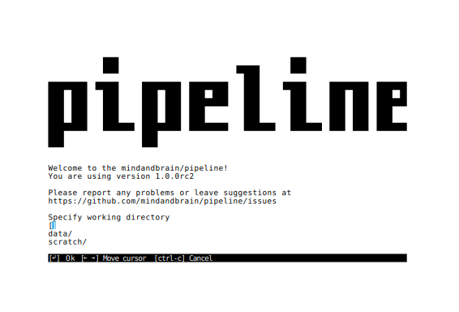

# Welcome to the mindandbrain/pipeline!

`mindandbrain/pipeline` is a user-friendly software that facilitates reproducible
analysis of fMRI data, including preprocessing, single-subject, and
group analysis. 
It provides state-of-the-art preprocessing using
[`fmriprep`](https://fmriprep.readthedocs.io/), but removes the necessity to
convert data to the
[`BIDS`](https://bids-specification.readthedocs.io/en/stable/) format. 
Common resting-state and task-based fMRI features can the be calculated
on the fly using [`FSL`](http://fsl.fmrib.ox.ac.uk/) with
[`nipype`](https://nipype.readthedocs.io/) for statistics.

> **NOTE:** The `mindandbrain/pipeline` is pre-release software and not yet
> considered production-ready.

## Table of Contents

<ol>
  <li>
    <a href="#getting-started">Getting started</a>
    <ol>
      <li><a href="#container-platform">Container platform</a></li>
      <li><a href="#download">Download</a></li>
    </ol>
  </li>
  <li><a href="#usage-of-the-user-interface">Usage of the user interface</a></li>
  <li><a href="#usage-on-a-high-performance-computing-cluster">Usage on a high-performance computing cluster</a></li>
  <li><a href="#command-line-options">Command line options</a></li>
  <li><a href="#troubleshooting">Troubleshooting</a></li>
  <li><a href="#contact">Contact</a></li>
</ol>

## 1. Getting started

The pipeline is distributed as a container, meaning that all software needed for
analysis comes bundled in it. This allows for easier installation on new
systems, and makes data analysis more reproducible, because software versions
are guaranteed to be the same for all users. 

### 1.1. Container platform

The first step is to install one of the supported container platforms. 
If you're using a high-performance computing cluster, more often than not
`Singularity` will already be available. 

If not, we recommend using the latest version of `Singularity`. However, it can
be somewhat cumbersome to install, as it needs to be built from source. 

The [`NeuroDebian`](https://neuro.debian.net/) package
repository provides an older version of `Singularity` for
[some](https://neuro.debian.net/pkgs/singularity-container.html) Linux
distributions.

In contrast to `Singularity`, `Docker` always requires elevated privileges to
run containers. In other words, every `Docker` user automatically has
administrator privileges on the computer they're using. Therefore, it is
inherently a bad choice for multi-user environments, where the goal is to limit
the access of individual users. `Docker` is the only option that is compatible
with `Mac OS X`. 

Container platform  | Version   | Installation
--------------------|-----------|--------------------------------------------------------------------
**Singularity**     | **3.5.3** | **See <https://sylabs.io/guides/3.5/user-guide/quick_start.html>**
Singularity         | 2.6.1     | `sudo apt install singularity-container`
Docker              |           | See <https://docs.docker.com/engine/install/>

### 1.2. Download

The second step is to download the `mindandbrain/pipeline` to your computer. 
This requires approximately 5 gigabytes of storage.

Container platform  | Command
--------------------|-------------------------------------------------
Singularity         | `singularity pull shub://mindandbrain/pipeline`
Docker              | `docker pull mindandbrain/pipeline`

`Singularity` version `3.x` creates a container image file called 
`pipeline_latest.sif` in the directory where you run the `pull` command.
For `Singularity` version `2.x` the file is named 
`mindandbrain-pipeline-master-latest.simg`.
Whenever you want to use the container, you need pass `Singularity` the path to
this file.
`Docker` will store the container in its storage base directory, so  it does
not matter from which directory you run the `pull` command.

### 1.3. Running

The third step is to run the downloaded container. 

Container platform  | Command
--------------------|--------------------------------------------------------------------------
Singularity         | `singularity run --no-home --cleanenv --bind /:/ext pipeline_latest.sif`
Docker              | `docker run --interactive --tty --volume /:/ext mindandbrain/pipeline`

You should now see the user interface.

#### Background

Containers are by default isolated from the host computer. This adds security,
but also means that the container cannot access the data it needs for analysis.
The `mindandbrain/pipeline` expects all inputs (e.g., image files and
spreadsheets) and outputs (the working directory) to be places in the path 
`/ext` (see also [--fs-root](#--fs-root)). Using the option `--bind /:/ext`, we
instruct `Singularity` to map all of the host file system (`/`) to that path
(`/ext`). 
You can also modify the option to map only part of the host file system, but
keep in mind that any directories that are not mapped will not be visible later.

`Singularity` passes the host shell environment to the container by default.
This means that in some cases, the host computer's configuration can interfere
with the pipeline. To avoid this, we need to pass the option `--cleanenv`.
`Docker` does not pass the host shell environment by default, so we don't need
to pass an option.

## 2. Usage of the user interface

> **TODO**

## 3. Usage on a high-performance computing cluster

> **TODO**

## 4. Command line options

> **TODO**

### 4.1. --fs-root

> **TODO**

### 4.2. --verbose and --debug

> **TODO**

## 5. Troubleshooting

> **TODO**

## 6. Contact

For questions or support, please submit an
[issue](https://github.com/mindandbrain/pipeline/issues/new/choose) or contact
us via e-mail.

 Name        | Role            | E-mail address
-------------|-----------------|------------------------
 Lea Waller  | Developer       | lea.waller@charite.de
 Ilya Veer   | Project manager | ilya.veer@charite.de
 Susanne Erk | Project manager | susanne.erk@charite.de
